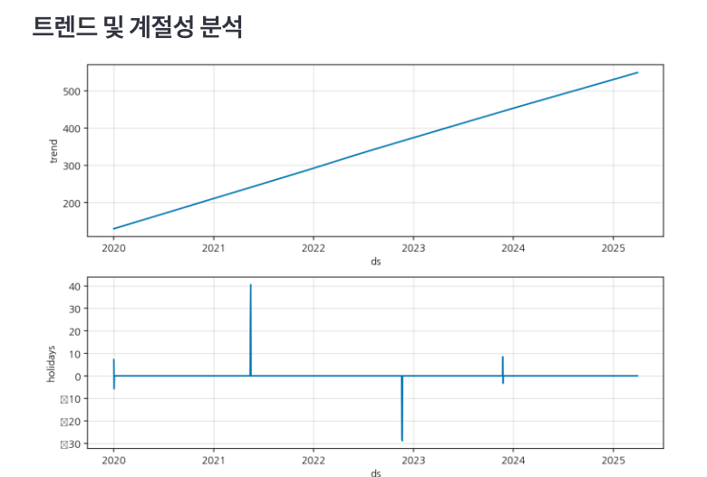

# prophet-sales

### 1. 트렌드(Trend) 분석 (상단 그래프)
#### 설명:
상단 그래프는 **시간에 따른 전반적인 매출 추세(Trend)**를 보여줍니다.

#### 해석:

* 일관된 상승 추세:
그래프가 2020년부터 2025년까지 꾸준히 상승하는 모습을 보여줍니다. 이는 기업의 매출이 시간이 지남에 따라 점진적으로 증가하고 있다는 의미입니다.
* 기울기:
기울기가 일정하므로 선형 성장 패턴을 나타냅니다. 별다른 급격한 변동 없이 꾸준히 성장하는 모습입니다.

### 2. 휴일(Holidays) 효과 분석 (하단 그래프)
#### 설명:
하단 그래프는 **특정 휴일(또는 프로모션)**이 매출에 어떤 영향을 주었는지를 시각화한 것입니다.

#### 축의 의미:

* X축(ds): 시간(날짜)을 나타냅니다.
* Y축(holidays): 휴일로 인한 매출 변화량을 나타냅니다.
* 양수(+) 값: 해당 휴일이 매출을 증가시켰음을 의미.
* 음수(-) 값: 해당 휴일이 매출을 감소시켰음을 의미.
* 값의 크기가 클수록 휴일의 영향력이 큽니다.

### 3. 구체적인 휴일 효과 해석
* 2021년 중반 (~40의 급등):
이 시점에서 휴일 또는 프로모션으로 인한 매출 급등이 발생했습니다. 예를 들어 신제품 출시나 대규모 마케팅 이벤트로 인해 매출이 일시적으로 증가했을 가능성이 큽니다.
* 2022년 초반 (~30의 급락):
이 구간에서는 휴일 또는 외부 요인으로 인해 매출이 급감했습니다. 예를 들어 공급 문제, 휴업일, 또는 예상치 못한 사건(예: 재고 부족, 경제적 이슈 등)이 매출에 부정적인 영향을 주었을 수 있습니다.
* 2023년 말 (~10의 소폭 상승):
매출이 소폭 상승한 것으로 보아 프로모션 효과가 크지는 않지만 긍정적인 영향을 준 이벤트로 해석할 수 있습니다. 이는 블랙 프라이데이나 연말 세일 같은 이벤트일 가능성이 있습니다.

